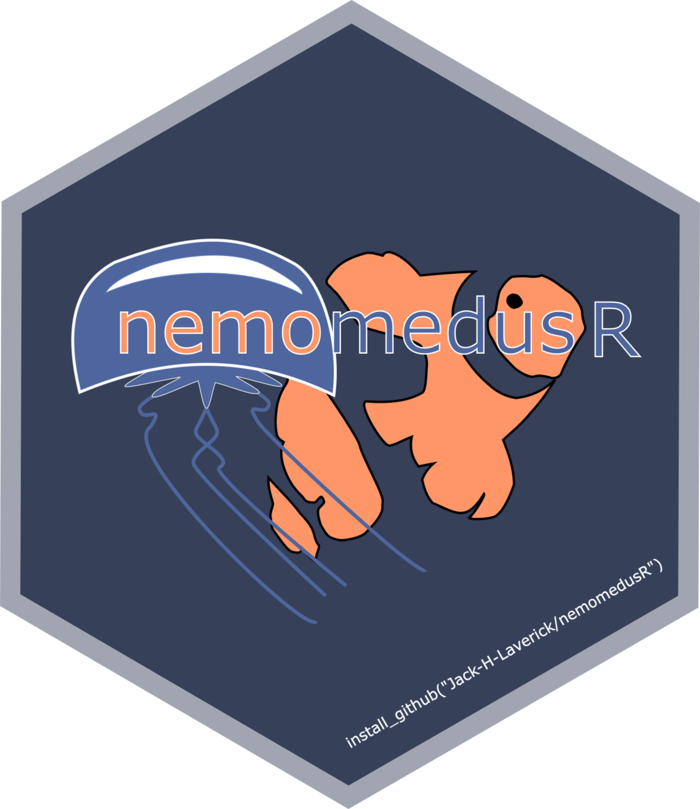

<!-- README.md is generated from README.Rmd. Please edit that file -->


# MiMeMo.tools <a href='https:/jack-h-laverick.github.io/MiMeMo.tools'></a>

<!-- badges: start -->

<!-- badges: end -->

MiMeMo.tools is an R package for data extraction and the
parameterisation of the end to end ecosystem model StrathE2Epolar.
MiMeMo will use StrathE2Epolar in the Barents Sea and East Greenland
Shelf. The functions contained in this package streamline the process of
sampling along the boundary, and within the volumes, of StrathE2E model
compartments.

## Installation

The internal facing / development version can be downloaded from
[GitHub](https://github.com/) with:

``` r
remotes::install_github("Jack-H-Laverick/MiMeMo.tools")
```

<br/>

<style>
div.red { background-color:#fec0c0; border-radius: 20px; padding: 10px;}
</style>

<div class="red">

❗ Installation will fail if Robert Wilson’s `rcdo` package is
unavailable. This might be true for Windows users.

</div>

## Project Documentation

**Proper documentation is a gift to future you.**

Head to
[GitHub.io](https://jack-h-laverick.github.io/MiMeMo.tools/index.html)
to view the full documentation.

<br/>

As expected for an R package, the navbar contains links to an index of
documented functions and a change log.

To document the wider work happening as part of MiMeMo you can find a
link to an overview of the different data sources being synthesised.
These are the “real” objects required in combination with the project
scripts to recreate the work so far.

An overview of the R scripts is also accessible from the navbar. This
covers the objectives of each script, their runtimes, and how scripts
depend on each other. An articles tab may be set up in future to give a
blow by blow account of each script.
